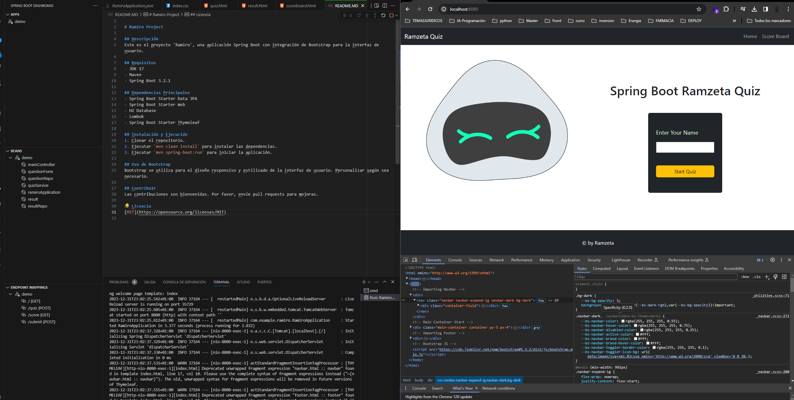

# Ramiro Project

## Descripción
Este es el proyecto 'Ramiro', una aplicación Spring Boot con integración de Bootstrap para la interfaz de usuario.

## Requisitos
- JDK 17
- Maven
- Spring Boot 3.2.1

## Dependencias Principales
- Spring Boot Starter Data JPA
- Spring Boot Starter Web
- H2 Database
- Lombok
- Spring Boot Starter Thymeleaf

## Instalación y Ejecución
1. Clonar el repositorio.
2. Ejecutar `mvn clean install` para instalar las dependencias.
3. Ejecutar `mvn spring-boot:run` para iniciar la aplicación.

## Uso de Bootstrap
Bootstrap se utiliza para el diseño responsivo y estilizado de la interfaz de usuario. Personalizar según sea necesario.

## Contribuir
Las contribuciones son bienvenidas. Por favor, envíe pull requests para mejoras.

## Licencia
[MIT](https://opensource.org/licenses/MIT)

"# quiz-java-spring" 
